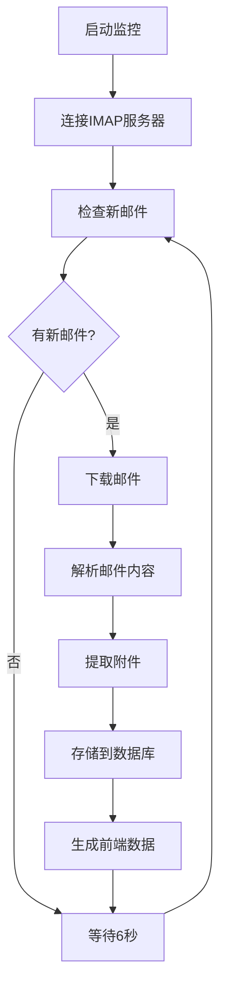
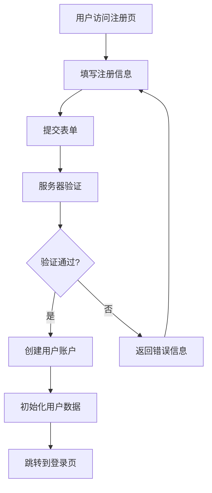

# 🔧 邮箱监控系统技术指南

## 🏗️ 系统架构

### 整体架构图

```
┌─────────────────────────────────────────────────────────────┐
│                    邮箱监控系统架构                          │
├─────────────────────────────────────────────────────────────┤
│  前端层 (Frontend)                                          │
│  ┌─────────────┐ ┌─────────────┐ ┌─────────────┐           │
│  │   HTML5     │ │    CSS3     │ │ JavaScript  │           │
│  │  Templates  │ │ Bootstrap 5 │ │   原生JS    │           │
│  └─────────────┘ └─────────────┘ └─────────────┘           │
├─────────────────────────────────────────────────────────────┤
│  应用层 (Application)                                       │
│  ┌─────────────┐ ┌─────────────┐ ┌─────────────┐           │
│  │ Flask Web   │ │  邮件监控   │ │  支付系统   │           │
│  │   应用      │ │   组件      │ │   集成      │           │
│  └─────────────┘ └─────────────┘ └─────────────┘           │
├─────────────────────────────────────────────────────────────┤
│  业务层 (Business Logic)                                   │
│  ┌─────────────┐ ┌─────────────┐ ┌─────────────┐           │
│  │  用户管理   │ │  邮件处理   │ │  计费系统   │           │
│  │   模块      │ │   模块      │ │   模块      │           │
│  └─────────────┘ └─────────────┘ └─────────────┘           │
├─────────────────────────────────────────────────────────────┤
│  数据层 (Data Access)                                      │
│  ┌─────────────┐ ┌─────────────┐ ┌─────────────┐           │
│  │ 数据库管理  │ │  文件存储   │ │  缓存系统   │           │
│  │   模块      │ │   模块      │ │  (可选)     │           │
│  └─────────────┘ └─────────────┘ └─────────────┘           │
├─────────────────────────────────────────────────────────────┤
│  基础设施层 (Infrastructure)                               │
│  ┌─────────────┐ ┌─────────────┐ ┌─────────────┐           │
│  │  MySQL      │ │  文件系统   │ │   IMAP      │           │
│  │  数据库     │ │   存储      │ │  邮件服务   │           │
│  └─────────────┘ └─────────────┘ └─────────────┘           │
└─────────────────────────────────────────────────────────────┘
```

### 核心组件

#### 1. Web应用层 (app.py)
- **Flask框架**: 提供HTTP服务和路由管理
- **模板引擎**: Jinja2模板渲染
- **会话管理**: 用户登录状态维护
- **API接口**: RESTful API设计

#### 2. 邮件监控系统
- **实时监控器** (realtime_monitor.py): IMAP协议监控
- **邮件解析器** (email_parser.py): .eml文件解析
- **组件连接器** (component_connector.py): 组件协调
- **QQ邮箱监控** (qq_email_monitor.py): 专用监控器

#### 3. 数据管理层
- **数据库管理器** (db_manager.py): MySQL连接池管理
- **配置管理** (config.py): 系统参数配置
- **邮件配置** (email_config.py): 邮箱连接配置

#### 4. 支付系统
- **易支付集成** (yipay_utils.py): 第三方支付
- **支付监控** (payment_monitor.py): 支付状态跟踪
- **计费处理** (email_cost_handler.py): 费用计算

## 🗄️ 数据库设计

### 核心表结构

#### 用户表 (users)
```sql
CREATE TABLE users (
    id INT AUTO_INCREMENT PRIMARY KEY,
    username VARCHAR(50) NOT NULL UNIQUE,
    password VARCHAR(255) NOT NULL,
    email VARCHAR(255) NULL,
    is_vip TINYINT(1) DEFAULT 0,
    is_admin TINYINT(1) DEFAULT 0,
    balance DECIMAL(10,2) DEFAULT 0.00,
    vip_expire_date DATETIME NULL,
    monthly_email_count INT DEFAULT 0,
    vip_email_count INT DEFAULT 0,
    created_at TIMESTAMP DEFAULT CURRENT_TIMESTAMP
);
```

#### 邮件表 (emails)
```sql
CREATE TABLE emails (
    id INT AUTO_INCREMENT PRIMARY KEY,
    email_id VARCHAR(255) NOT NULL UNIQUE,
    sender VARCHAR(255) NOT NULL,
    recipient VARCHAR(255) NOT NULL,
    subject TEXT,
    content LONGTEXT,
    html_content LONGTEXT,
    received_at DATETIME NOT NULL,
    created_at TIMESTAMP DEFAULT CURRENT_TIMESTAMP
);
```

#### 用户邮箱表 (user_emails)
```sql
CREATE TABLE user_emails (
    id INT AUTO_INCREMENT PRIMARY KEY,
    user_id INT NOT NULL,
    email_address VARCHAR(255) NOT NULL UNIQUE,
    domain VARCHAR(100) NOT NULL,
    created_at TIMESTAMP DEFAULT CURRENT_TIMESTAMP,
    FOREIGN KEY (user_id) REFERENCES users(id)
);
```

### 数据关系图

```
users (1) ──────── (N) user_emails
  │                      │
  │                      │
  └── (1) ──────── (N) emails ──────── (N) attachments
           user_id              email_id
```

## 🔄 业务流程

### 邮件监控流程



### 用户注册流程



### 邮件发送流程

```mermaid
graph TD
    A[用户写邮件] --> B[选择发件人邮箱]
    B --> C[填写邮件内容]
    C --> D[上传附件(可选)]
    D --> E[点击发送]
    E --> F[检查余额]
    F --> G{余额充足?}
    G -->|是| H[扣除费用]
    G -->|否| I[提示充值]
    H --> J[调用发送API]
    J --> K[保存到数据库]
    K --> L[返回发送结果]
    I --> A
```

## 🔧 技术栈详解

### 后端技术

#### Python 3.9+
- **Flask 2.3.3**: Web框架
- **mysql-connector-python 8.1.0**: MySQL驱动
- **bcrypt 4.0.1**: 密码加密
- **requests 2.31.0**: HTTP客户端

#### 数据库
- **MySQL 8.0**: 主数据库
- **连接池**: 支持并发连接
- **事务支持**: 数据一致性保证
- **索引优化**: 查询性能优化

### 前端技术

#### HTML5 + CSS3
- **语义化标签**: 提高可访问性
- **响应式设计**: 支持多设备
- **CSS Grid/Flexbox**: 现代布局

#### Bootstrap 5
- **组件库**: 丰富的UI组件
- **主题定制**: 自定义样式
- **图标系统**: Bootstrap Icons

#### JavaScript
- **原生JS**: 无框架依赖
- **AJAX**: 异步数据交互
- **表单验证**: 客户端验证

### 邮件技术

#### IMAP协议
- **SSL/TLS加密**: 安全连接
- **实时监控**: 6秒检查间隔
- **多邮箱支持**: 支持多个邮箱账户

#### 邮件解析
- **MIME解析**: 支持多媒体邮件
- **编码处理**: 自动识别字符编码
- **附件提取**: 自动保存附件文件

## 🚀 性能优化

### 数据库优化

1. **连接池管理**
   ```python
   # 使用连接池避免频繁连接
   pool = mysql.connector.pooling.MySQLConnectionPool(
       pool_name="email_pool",
       pool_size=10,
       **db_config
   )
   ```

2. **索引优化**
   ```sql
   -- 邮件查询索引
   CREATE INDEX idx_recipient ON emails(recipient);
   CREATE INDEX idx_received_at ON emails(received_at);
   
   -- 用户邮箱索引
   CREATE INDEX idx_user_email ON user_emails(user_id, email_address);
   ```

3. **查询优化**
   ```python
   # 分页查询避免大量数据加载
   def get_emails_paginated(user_id, page=1, per_page=20):
       offset = (page - 1) * per_page
       query = """
       SELECT * FROM emails 
       WHERE recipient IN (SELECT email_address FROM user_emails WHERE user_id = %s)
       ORDER BY received_at DESC 
       LIMIT %s OFFSET %s
       """
   ```

### 应用优化

1. **异步处理**
   ```python
   # 邮件处理异步队列
   import threading
   import queue
   
   email_queue = queue.Queue()
   
   def process_emails():
       while True:
           email_data = email_queue.get()
           # 处理邮件逻辑
           email_queue.task_done()
   ```

2. **缓存机制**
   ```python
   # 用户会话缓存
   from functools import lru_cache
   
   @lru_cache(maxsize=128)
   def get_user_info(user_id):
       # 缓存用户信息
       return db_manager.get_user_by_id(user_id)
   ```

3. **静态资源优化**
   ```html
   <!-- CSS/JS压缩和合并 -->
   <link rel="stylesheet" href="/static/css/app.min.css">
   <script src="/static/js/app.min.js"></script>
   ```

## 🔒 安全设计

### 认证和授权

1. **密码安全**
   ```python
   import bcrypt
   
   # 密码加密
   def hash_password(password):
       return bcrypt.hashpw(password.encode('utf-8'), bcrypt.gensalt())
   
   # 密码验证
   def verify_password(password, hashed):
       return bcrypt.checkpw(password.encode('utf-8'), hashed)
   ```

2. **会话管理**
   ```python
   # Flask会话配置
   app.config['SESSION_COOKIE_SECURE'] = True
   app.config['SESSION_COOKIE_HTTPONLY'] = True
   app.config['SESSION_COOKIE_SAMESITE'] = 'Lax'
   ```

3. **权限控制**
   ```python
   def require_admin(f):
       @wraps(f)
       def decorated_function(*args, **kwargs):
           if not session.get('is_admin'):
               return redirect(url_for('login'))
           return f(*args, **kwargs)
       return decorated_function
   ```

### 数据安全

1. **SQL注入防护**
   ```python
   # 使用参数化查询
   cursor.execute("SELECT * FROM users WHERE username = %s", (username,))
   ```

2. **XSS防护**
   ```python
   from markupsafe import escape
   
   # 输出转义
   safe_content = escape(user_input)
   ```

3. **CSRF防护**
   ```python
   # Flask-WTF CSRF保护
   from flask_wtf.csrf import CSRFProtect
   csrf = CSRFProtect(app)
   ```

## 📊 监控和日志

### 应用监控

1. **性能监控**
   ```python
   import time
   import logging
   
   def monitor_performance(func):
       def wrapper(*args, **kwargs):
           start_time = time.time()
           result = func(*args, **kwargs)
           end_time = time.time()
           logging.info(f"{func.__name__} 执行时间: {end_time - start_time:.2f}秒")
           return result
       return wrapper
   ```

2. **错误监控**
   ```python
   @app.errorhandler(500)
   def internal_error(error):
       logging.error(f"服务器错误: {error}")
       return render_template('error.html'), 500
   ```

### 日志系统

```python
import logging
from logging.handlers import RotatingFileHandler

# 配置日志
logging.basicConfig(
    level=logging.INFO,
    format='%(asctime)s %(levelname)s %(name)s %(message)s'
)

# 文件日志
file_handler = RotatingFileHandler('logs/app.log', maxBytes=10240, backupCount=10)
app.logger.addHandler(file_handler)
```

## 🔧 开发环境

### 本地开发设置

1. **环境准备**
   ```bash
   # 创建虚拟环境
   python -m venv venv
   source venv/bin/activate  # Linux/Mac
   venv\Scripts\activate     # Windows
   
   # 安装依赖
   pip install -r requirements.txt
   ```

2. **数据库设置**
   ```bash
   # 启动MySQL
   mysql -u root -p
   
   # 创建数据库
   CREATE DATABASE cloudfare_qq_mail_dev;
   
   # 初始化表结构
   python database/setup_database.py
   ```

3. **配置文件**
   ```python
   # 开发环境配置
   DEBUG = True
   DB_HOST = 'localhost'
   DB_NAME = 'cloudfare_qq_mail_dev'
   ```

### 测试环境

```python
# 单元测试
import unittest

class TestEmailParser(unittest.TestCase):
    def test_parse_email(self):
        parser = EmailParser()
        result = parser.parse_email('test.eml')
        self.assertIsNotNone(result)

if __name__ == '__main__':
    unittest.main()
```

## 📈 扩展性设计

### 微服务架构准备

```python
# 服务拆分准备
class EmailService:
    def __init__(self):
        self.monitor = EmailMonitor()
        self.parser = EmailParser()
    
    def process_email(self, email_data):
        # 邮件处理逻辑
        pass

class UserService:
    def __init__(self):
        self.db = DatabaseManager()
    
    def create_user(self, user_data):
        # 用户创建逻辑
        pass
```

### API版本控制

```python
# API版本路由
@app.route('/api/v1/emails')
def get_emails_v1():
    # v1版本API
    pass

@app.route('/api/v2/emails')
def get_emails_v2():
    # v2版本API
    pass
```

这个技术指南为开发者提供了系统的完整技术视图，包括架构设计、数据库设计、性能优化、安全考虑等各个方面的详细信息。
