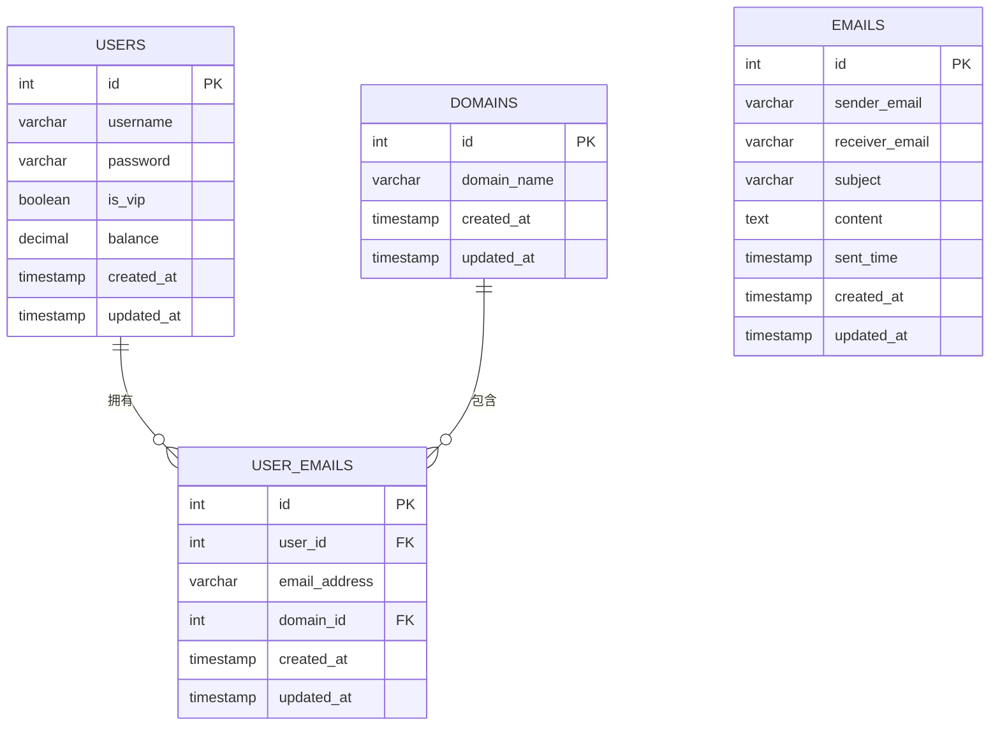

# 邮箱监控系统数据库设计文档

## 1. 概述

本数据库设计文档详细描述了邮箱监控系统的数据库结构，包括表结构、字段说明、关系约束等。

## 2. 数据库环境

- **数据库系统**: MySQL 5.7+
- **字符集**: utf8mb4
- **排序规则**: utf8mb4_unicode_ci

## 3. 表结构设计

### 3.1 用户表 (users)

#### 3.1.1 表结构
```sql
CREATE TABLE IF NOT EXISTS users (
    id INT AUTO_INCREMENT PRIMARY KEY,
    username VARCHAR(50) NOT NULL UNIQUE,
    password VARCHAR(255) NOT NULL,
    is_vip BOOLEAN DEFAULT FALSE,
    balance DECIMAL(10, 2) DEFAULT 0.00,
    created_at TIMESTAMP DEFAULT CURRENT_TIMESTAMP,
    updated_at TIMESTAMP DEFAULT CURRENT_TIMESTAMP ON UPDATE CURRENT_TIMESTAMP
);
```

#### 3.1.2 字段说明
| 字段名 | 类型 | 约束 | 说明 |
|--------|------|------|------|
| id | INT | PRIMARY KEY, AUTO_INCREMENT | 用户唯一标识 |
| username | VARCHAR(50) | NOT NULL, UNIQUE | 用户名 |
| password | VARCHAR(255) | NOT NULL | 密码（加密存储） |
| is_vip | BOOLEAN | DEFAULT FALSE | VIP状态 |
| balance | DECIMAL(10, 2) | DEFAULT 0.00 | 账户余额 |
| created_at | TIMESTAMP | DEFAULT CURRENT_TIMESTAMP | 创建时间 |
| updated_at | TIMESTAMP | DEFAULT CURRENT_TIMESTAMP ON UPDATE CURRENT_TIMESTAMP | 更新时间 |

### 3.2 域名表 (domains)

#### 3.2.1 表结构
```sql
CREATE TABLE IF NOT EXISTS domains (
    id INT AUTO_INCREMENT PRIMARY KEY,
    domain_name VARCHAR(100) NOT NULL UNIQUE,
    created_at TIMESTAMP DEFAULT CURRENT_TIMESTAMP,
    updated_at TIMESTAMP DEFAULT CURRENT_TIMESTAMP ON UPDATE CURRENT_TIMESTAMP
);
```

#### 3.2.2 字段说明
| 字段名 | 类型 | 约束 | 说明 |
|--------|------|------|------|
| id | INT | PRIMARY KEY, AUTO_INCREMENT | 域名唯一标识 |
| domain_name | VARCHAR(100) | NOT NULL, UNIQUE | 域名 |
| created_at | TIMESTAMP | DEFAULT CURRENT_TIMESTAMP | 创建时间 |
| updated_at | TIMESTAMP | DEFAULT CURRENT_TIMESTAMP ON UPDATE CURRENT_TIMESTAMP | 更新时间 |

### 3.3 邮件表 (emails)

#### 3.3.1 表结构
```sql
CREATE TABLE IF NOT EXISTS emails (
    id INT AUTO_INCREMENT PRIMARY KEY,
    sender_email VARCHAR(100) NOT NULL,
    receiver_email VARCHAR(100) NOT NULL,
    subject VARCHAR(255),
    content TEXT,
    sent_time TIMESTAMP DEFAULT CURRENT_TIMESTAMP,
    created_at TIMESTAMP DEFAULT CURRENT_TIMESTAMP,
    updated_at TIMESTAMP DEFAULT CURRENT_TIMESTAMP ON UPDATE CURRENT_TIMESTAMP
);
```

#### 3.3.2 字段说明
| 字段名 | 类型 | 约束 | 说明 |
|--------|------|------|------|
| id | INT | PRIMARY KEY, AUTO_INCREMENT | 邮件唯一标识 |
| sender_email | VARCHAR(100) | NOT NULL | 发件人邮箱 |
| receiver_email | VARCHAR(100) | NOT NULL | 收件人邮箱 |
| subject | VARCHAR(255) |  | 邮件主题 |
| content | TEXT |  | 邮件内容 |
| sent_time | TIMESTAMP | DEFAULT CURRENT_TIMESTAMP | 邮件发送时间 |
| created_at | TIMESTAMP | DEFAULT CURRENT_TIMESTAMP | 创建时间 |
| updated_at | TIMESTAMP | DEFAULT CURRENT_TIMESTAMP ON UPDATE CURRENT_TIMESTAMP | 更新时间 |

### 3.4 用户邮箱表 (user_emails)

#### 3.4.1 表结构
```sql
CREATE TABLE IF NOT EXISTS user_emails (
    id INT AUTO_INCREMENT PRIMARY KEY,
    user_id INT NOT NULL,
    email_address VARCHAR(100) NOT NULL,
    domain_id INT NOT NULL,
    created_at TIMESTAMP DEFAULT CURRENT_TIMESTAMP,
    updated_at TIMESTAMP DEFAULT CURRENT_TIMESTAMP ON UPDATE CURRENT_TIMESTAMP,
    FOREIGN KEY (user_id) REFERENCES users(id) ON DELETE CASCADE,
    FOREIGN KEY (domain_id) REFERENCES domains(id) ON DELETE CASCADE,
    UNIQUE KEY unique_user_email (user_id, email_address)
);
```

#### 3.4.2 字段说明
| 字段名 | 类型 | 约束 | 说明 |
|--------|------|------|------|
| id | INT | PRIMARY KEY, AUTO_INCREMENT | 用户邮箱唯一标识 |
| user_id | INT | NOT NULL, FOREIGN KEY | 关联用户ID |
| email_address | VARCHAR(100) | NOT NULL | 邮箱地址 |
| domain_id | INT | NOT NULL, FOREIGN KEY | 关联域名ID |
| created_at | TIMESTAMP | DEFAULT CURRENT_TIMESTAMP | 创建时间 |
| updated_at | TIMESTAMP | DEFAULT CURRENT_TIMESTAMP ON UPDATE CURRENT_TIMESTAMP | 更新时间 |

## 4. 表关系图



## 5. 索引设计

### 5.1 用户表索引
- 主键索引: id
- 唯一索引: username

### 5.2 域名表索引
- 主键索引: id
- 唯一索引: domain_name

### 5.3 邮件表索引
- 主键索引: id
- 普通索引: sender_email
- 普通索引: receiver_email
- 普通索引: sent_time

### 5.4 用户邮箱表索引
- 主键索引: id
- 外键索引: user_id
- 外键索引: domain_id
- 唯一索引: unique_user_email (user_id, email_address)

## 6. 数据库操作接口

### 6.1 用户操作
- 创建用户
- 查询用户（根据用户名）
- 查询所有用户
- 更新用户信息
- 删除用户

### 6.2 域名操作
- 创建域名
- 查询所有域名
- 更新域名信息
- 删除域名

### 6.3 邮件操作
- 保存邮件
- 查询邮件
- 更新邮件信息
- 删除邮件

### 6.4 用户邮箱操作
- 创建用户邮箱
- 查询用户邮箱（根据用户ID）
- 更新用户邮箱信息
- 删除用户邮箱

## 7. 数据库初始化脚本

```sql
-- 创建数据库
CREATE DATABASE IF NOT EXISTS cloudfare_qq_mail CHARACTER SET utf8mb4 COLLATE utf8mb4_unicode_ci;

-- 使用数据库
USE cloudfare_qq_mail;

-- 创建用户表
CREATE TABLE IF NOT EXISTS users (
    id INT AUTO_INCREMENT PRIMARY KEY,
    username VARCHAR(50) NOT NULL UNIQUE,
    password VARCHAR(255) NOT NULL,
    is_vip BOOLEAN DEFAULT FALSE,
    balance DECIMAL(10, 2) DEFAULT 0.00,
    created_at TIMESTAMP DEFAULT CURRENT_TIMESTAMP,
    updated_at TIMESTAMP DEFAULT CURRENT_TIMESTAMP ON UPDATE CURRENT_TIMESTAMP
);

-- 创建域名表
CREATE TABLE IF NOT EXISTS domains (
    id INT AUTO_INCREMENT PRIMARY KEY,
    domain_name VARCHAR(100) NOT NULL UNIQUE,
    created_at TIMESTAMP DEFAULT CURRENT_TIMESTAMP,
    updated_at TIMESTAMP DEFAULT CURRENT_TIMESTAMP ON UPDATE CURRENT_TIMESTAMP
);

-- 创建邮件表
CREATE TABLE IF NOT EXISTS emails (
    id INT AUTO_INCREMENT PRIMARY KEY,
    sender_email VARCHAR(100) NOT NULL,
    receiver_email VARCHAR(100) NOT NULL,
    subject VARCHAR(255),
    content TEXT,
    sent_time TIMESTAMP DEFAULT CURRENT_TIMESTAMP,
    created_at TIMESTAMP DEFAULT CURRENT_TIMESTAMP,
    updated_at TIMESTAMP DEFAULT CURRENT_TIMESTAMP ON UPDATE CURRENT_TIMESTAMP
);

-- 创建用户邮箱表
CREATE TABLE IF NOT EXISTS user_emails (
    id INT AUTO_INCREMENT PRIMARY KEY,
    user_id INT NOT NULL,
    email_address VARCHAR(100) NOT NULL,
    domain_id INT NOT NULL,
    created_at TIMESTAMP DEFAULT CURRENT_TIMESTAMP,
    updated_at TIMESTAMP DEFAULT CURRENT_TIMESTAMP ON UPDATE CURRENT_TIMESTAMP,
    FOREIGN KEY (user_id) REFERENCES users(id) ON DELETE CASCADE,
    FOREIGN KEY (domain_id) REFERENCES domains(id) ON DELETE CASCADE,
    UNIQUE KEY unique_user_email (user_id, email_address)
);

-- 插入示例数据
-- 插入示例域名
INSERT IGNORE INTO domains (domain_name) VALUES 
('shiep.edu.kg'),
('example.com'),
('test.org');

-- 插入示例用户
INSERT IGNORE INTO users (username, password, is_vip, balance) VALUES 
('admin', '$2b$12$LQv3c1yqBWVHxkd0LHAkCOYz6TtxMQJqhN8/LewdBPj/RK.PZvO.S', TRUE, 100.00),
('user1', '$2b$12$LQv3c1yqBWVHxkd0LHAkCOYz6TtxMQJqhN8/LewdBPj/RK.PZvO.S', FALSE, 50.00);

-- 插入示例用户邮箱
INSERT IGNORE INTO user_emails (user_id, email_address, domain_id) VALUES 
(1, 'admin@shiep.edu.kg', 1),
(2, 'user1@example.com', 2);
```

## 8. 数据库管理类

### 8.1 DatabaseManager 类
数据库管理类提供对数据库的基本操作接口：

```python
class DatabaseManager:
    def __init__(self):
        """初始化数据库管理器"""
    
    def connect(self):
        """连接到数据库"""
    
    def disconnect(self):
        """断开数据库连接"""
    
    def execute_query(self, query, params=None):
        """执行查询语句"""
    
    def execute_update(self, query, params=None):
        """执行更新语句"""
    
    def create_user(self, username, password, is_vip=False, balance=0.0):
        """创建用户"""
    
    def get_user_by_username(self, username):
        """根据用户名获取用户信息"""
    
    def get_all_domains(self):
        """获取所有域名"""
    
    def create_domain(self, domain_name):
        """创建域名"""
    
    def get_user_emails(self, user_id):
        """获取用户的所有邮箱"""
    
    def create_user_email(self, user_id, email_address, domain_id):
        """创建用户邮箱"""
    
    def save_email(self, sender_email, receiver_email, subject, content, sent_time):
        """保存邮件信息"""
    
    def get_all_users(self):
        """获取所有用户"""
    
    def update_user(self, user_id, username, email, is_vip, balance):
        """更新用户信息"""
    
    def delete_user(self, user_id):
        """删除用户"""
```

## 9. 性能优化建议

### 9.1 索引优化
- 根据查询需求创建合适的索引
- 定期分析和优化索引使用情况

### 9.2 查询优化
- 避免使用SELECT *
- 使用LIMIT限制返回结果数量
- 优化复杂查询语句

### 9.3 连接池管理
- 使用连接池管理数据库连接
- 合理设置连接池大小

## 10. 安全考虑

### 10.1 SQL注入防护
- 使用参数化查询
- 验证和过滤用户输入

### 10.2 数据加密
- 密码加密存储
- 敏感数据传输加密

### 10.3 访问控制
- 用户权限验证
- 数据访问控制