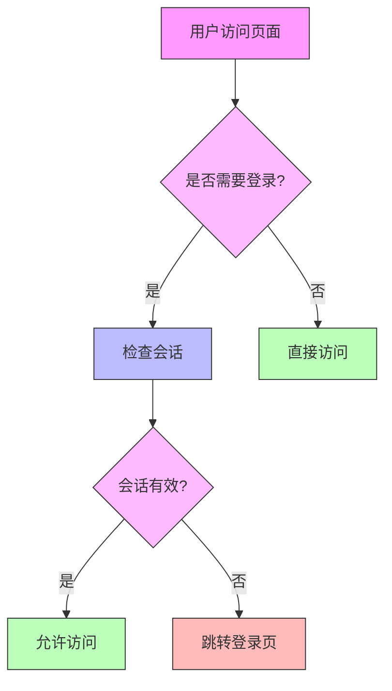
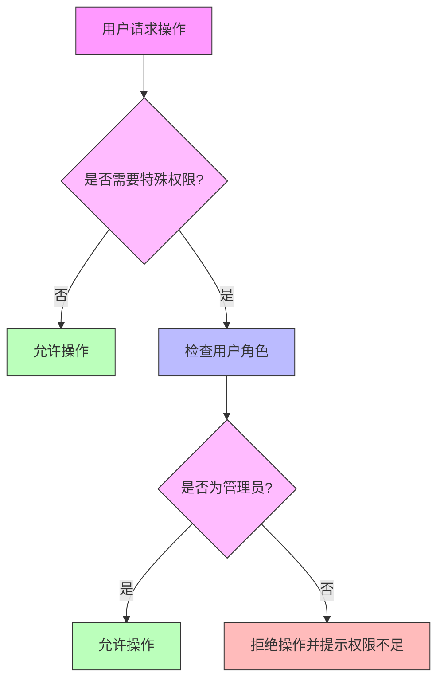

# 邮箱监控系统用户权限管理文档

## 1. 概述

本权限管理文档详细描述了邮箱监控系统的用户权限控制机制，包括用户角色、权限分配、访问控制等方面。

## 2. 用户角色设计

### 2.1 角色分类
系统将用户分为以下角色：
- **普通用户**: 系统的基本使用者，可以查看与自己相关的邮件
- **管理员用户**: 系统的管理者，拥有更高的权限，可以管理用户和域名

### 2.2 角色权限对比

| 功能模块 | 普通用户 | 管理员用户 |
|---------|---------|-----------|
| 用户注册/登录 | ✓ | ✓ |
| 个人资料管理 | ✓ | ✓ |
| 邮件查看 | ✓ (仅相关邮件) | ✓ (所有邮件) |
| 邮件搜索/过滤 | ✓ | ✓ |
| 用户管理 | ✗ | ✓ |
| 域名管理 | ✗ | ✓ |

## 3. 权限控制机制

### 3.1 用户认证
- 用户通过用户名和密码进行身份验证
- 使用会话管理用户登录状态
- 密码采用加密存储

### 3.2 访问控制
- 基于角色的访问控制(RBAC)
- 不同角色具有不同的页面访问权限
- 敏感操作需要相应权限验证

### 3.3 数据权限
- 普通用户只能访问与自己相关的数据
- 管理员用户可以访问所有用户数据
- 邮件数据根据收件人和发件人进行过滤

## 4. 用户表设计

### 4.1 字段说明
```sql
CREATE TABLE IF NOT EXISTS users (
    id INT AUTO_INCREMENT PRIMARY KEY,
    username VARCHAR(50) NOT NULL UNIQUE,
    password VARCHAR(255) NOT NULL,
    is_vip BOOLEAN DEFAULT FALSE,
    balance DECIMAL(10, 2) DEFAULT 0.00,
    created_at TIMESTAMP DEFAULT CURRENT_TIMESTAMP,
    updated_at TIMESTAMP DEFAULT CURRENT_TIMESTAMP ON UPDATE CURRENT_TIMESTAMP
);
```

### 4.2 权限相关字段
- **is_vip**: 布尔值，标识用户是否为VIP用户（管理员）
- **balance**: 数值型，用户账户余额

## 5. 权限验证流程

### 5.1 登录验证流程


### 5.2 权限验证流程


## 6. 页面权限控制

### 6.1 首页权限控制
- 所有用户都可以访问
- 根据登录状态显示不同内容
- 未登录用户显示登录/注册入口
- 已登录用户显示邮件相关功能入口

### 6.2 邮件列表页权限控制
- 仅登录用户可以访问
- 普通用户只能查看与自己相关的邮件
- 管理员用户可以查看所有邮件

### 6.3 用户管理页权限控制
- 仅管理员用户可以访问
- 普通用户访问时跳转到首页或提示权限不足

### 6.4 域名管理页权限控制
- 仅管理员用户可以访问
- 普通用户访问时跳转到首页或提示权限不足

## 7. API权限控制

### 7.1 用户认证API
- `/login`: 所有用户可访问
- `/register`: 所有用户可访问
- `/logout`: 仅登录用户可访问

### 7.2 邮件管理API
- `/api/mails`: 仅登录用户可访问
- `/api/mail/<int:mail_id>`: 仅登录用户可访问

### 7.3 用户管理API
- `/api/admin/users`: 仅管理员用户可访问
- `/api/admin/users/<int:user_id>`: 仅管理员用户可访问

### 7.4 域名管理API
- `/api/admin/domains`: 仅管理员用户可访问

## 8. 权限控制实现

### 8.1 Flask装饰器实现
```python
from functools import wraps
from flask import session, redirect, url_for

def login_required(f):
    """登录验证装饰器"""
    @wraps(f)
    def decorated_function(*args, **kwargs):
        if 'user_id' not in session:
            return redirect(url_for('login'))
        return f(*args, **kwargs)
    return decorated_function

def admin_required(f):
    """管理员权限验证装饰器"""
    @wraps(f)
    def decorated_function(*args, **kwargs):
        if 'user_id' not in session:
            return redirect(url_for('login'))
        # 这里需要检查用户是否为管理员
        # 暂时假设所有登录用户都是管理员
        return f(*args, **kwargs)
    return decorated_function
```

### 8.2 页面模板权限控制
在Flask模板中使用Jinja2语法进行权限控制：

```html
<!-- 根据用户角色显示不同内容 -->

    
        <!-- 管理员用户内容 -->
        <a href="{{ url_for('admin_users') }}">用户管理</a>
        <a href="{{ url_for('admin_domains') }}">域名管理</a>
    

```

## 9. 权限管理功能

### 9.1 用户管理功能
- 管理员可以查看所有用户列表
- 管理员可以添加新用户
- 管理员可以编辑用户信息
- 管理员可以删除用户
- 管理员可以设置用户VIP状态
- 管理员可以调整用户账户余额

### 9.2 域名管理功能
- 管理员可以查看所有域名列表
- 管理员可以添加新域名
- 管理员可以编辑域名信息
- 管理员可以删除域名

## 10. 安全考虑

### 10.1 会话安全
- 使用安全的会话管理机制
- 设置会话过期时间
- 防止会话劫持

### 10.2 密码安全
- 密码加密存储
- 密码强度验证
- 防止暴力破解

### 10.3 访问控制安全
- 服务端验证权限
- 防止越权访问
- 记录权限违规操作

## 11. 权限测试计划

### 11.1 功能测试
- 验证不同角色用户的页面访问权限
- 验证不同角色用户的API访问权限
- 验证权限变更后的访问控制

### 11.2 安全测试
- 测试越权访问防护
- 测试会话安全机制
- 测试密码安全机制

## 12. 权限管理扩展

### 12.1 角色扩展
- 可以增加更多用户角色
- 支持更细粒度的权限控制
- 支持角色继承机制

### 12.2 权限扩展
- 可以增加更多权限类型
- 支持基于资源的权限控制
- 支持动态权限分配

## 13. 权限管理API

### 13.1 用户权限API
```python
# 检查用户是否为管理员
def is_admin(user_id):
    """检查用户是否为管理员"""
    # 实现检查逻辑
    pass

# 获取用户权限列表
def get_user_permissions(user_id):
    """获取用户权限列表"""
    # 实现获取权限逻辑
    pass
```

### 13.2 权限验证API
```python
# 验证用户权限
def check_permission(user_id, permission):
    """验证用户是否具有指定权限"""
    # 实现权限验证逻辑
    pass
```

## 14. 权限管理最佳实践

### 14.1 设计原则
- 最小权限原则
- 职责分离原则
- 纵深防御原则

### 14.2 实现建议
- 服务端验证权限
- 记录权限操作日志
- 定期审查权限设置