# 邮箱监控系统架构设计文档

## 1. 系统概述

### 1.1 项目背景
本系统是一个基于Python和Flask的邮箱监控系统，可以实时监控特定域名的邮件并将其解析为可读格式。系统专门监控 `shiep.edu.kg` 域名的邮件，每6秒检查一次，只处理启动后收到的新邮件。

### 1.2 核心功能
- 实时监控特定域名的邮件
- 邮件内容解析和HTML生成
- 用户认证和权限管理
- 多域名支持
- 数据库存储邮件和用户信息

## 2. 技术架构

### 2.1 技术栈
- **后端**: Python 3, Flask
- **数据库**: MySQL
- **前端**: HTML5, CSS3, JavaScript, Bootstrap 5
- **邮件协议**: IMAP

### 2.2 系统架构图

## 3. 核心组件设计

### 3.1 实时邮件监控器 (RealtimeEmailMonitor)
实时邮件监控器负责监控QQ邮箱中的新邮件，并将目标域名的邮件加入异步处理队列。

#### 3.1.1 主要功能
- 连接QQ邮箱IMAP服务器
- 检查新邮件（每6秒一次）
- 过滤目标域名邮件
- 异步队列处理

#### 3.1.2 工作流程

### 3.2 邮件解析器 (EmailParser)
邮件解析器负责解析.eml格式的邮件文件，提取邮件内容并生成HTML显示文件。

#### 3.2.1 主要功能
- 解析邮件头部信息
- 提取邮件正文内容
- 处理附件
- 重构HTML用于前端显示

### 3.3 自动邮件处理器 (AutoEmailProcessor)
自动邮件处理器整合了邮件监控、下载、转换、解析和存储的完整流程。

#### 3.3.1 主要功能
- 监控新邮件
- 保存为.eml文件
- 解析邮件内容
- 生成HTML显示文件
- 保存附件

### 3.4 Web应用 (Flask App)
Web应用提供用户界面，支持用户认证、权限管理和邮件展示。

#### 3.4.1 主要功能
- 用户注册/登录
- 权限管理（普通用户/管理员）
- 邮件列表展示
- 邮件详情查看
- 用户管理
- 域名管理

## 4. 数据库设计

### 4.1 数据库表结构

```mermaid
erDiagram
    USERS ||--o{ USER_EMAILS : "拥有"
    DOMAINS ||--o{ USER_EMAILS : "包含"
    USERS {
        int id PK
        varchar username
        varchar password
        boolean is_vip
        decimal balance
        timestamp created_at
        timestamp updated_at
    }
    
    DOMAINS {
        int id PK
        varchar domain_name
        timestamp created_at
        timestamp updated_at
    }
    
    EMAILS {
        int id PK
        varchar sender_email
        varchar receiver_email
        varchar subject
        text content
        timestamp sent_time
        timestamp created_at
        timestamp updated_at
    }
    
    USER_EMAILS {
        int id PK
        int user_id FK
        varchar email_address
        int domain_id FK
        timestamp created_at
        timestamp updated_at
    }
```

### 4.2 表关系说明
- **用户表 (users)**: 存储用户信息，包括用户名、密码、VIP状态和余额
- **域名表 (domains)**: 存储支持的域名信息
- **邮件表 (emails)**: 存储邮件信息，包括发件人、收件人、主题和内容
- **用户邮箱表 (user_emails)**: 存储用户创建的邮箱信息

## 5. 前端设计

### 5.1 页面结构
- **首页**: 系统介绍和登录入口
- **登录页**: 用户登录界面
- **注册页**: 用户注册界面
- **邮件列表页**: 显示用户相关的邮件列表
- **邮件详情页**: 显示邮件详细内容
- **用户管理页**: 管理员用户管理界面
- **域名管理页**: 管理员域名管理界面
- **个人资料页**: 用户个人信息管理界面

### 5.2 前端技术栈
- **框架**: Bootstrap 5
- **样式**: 自定义CSS
- **交互**: 原生JavaScript

## 6. 系统部署

### 6.1 环境要求
- Python 3.7+
- MySQL 5.7+
- pip包管理器

### 6.2 部署步骤
1. 克隆项目代码
2. 安装Python依赖
3. 配置数据库连接
4. 创建数据库和表格
5. 运行Flask应用

## 7. 性能优化

### 7.1 异步处理
系统采用异步队列处理架构，支持高并发邮件处理：
- 主监控线程负责检测新邮件
- 工作线程池负责邮件解析和处理
- 队列机制避免阻塞监控主流程

### 7.2 资源管理
- 连接池管理数据库连接
- 内存优化避免重复处理
- 自动清理过期附件

## 8. 安全设计

### 8.1 用户认证
- 用户名/密码认证
- 会话管理
- 权限控制

### 8.2 数据安全
- 数据库连接加密
- 敏感信息配置文件管理
- SQL注入防护

## 9. 扩展计划

### 9.1 功能扩展
- 多域名支持扩展
- 附件分级存储策略
- Docker容器化部署

### 9.2 性能扩展
- 负载均衡支持
- 数据库读写分离
- 缓存机制优化

## 10. 运维监控

### 10.1 日志管理
- 系统运行日志
- 错误日志记录
- 性能统计日志

### 10.2 监控指标
- 邮件处理成功率
- 系统响应时间
- 资源使用情况