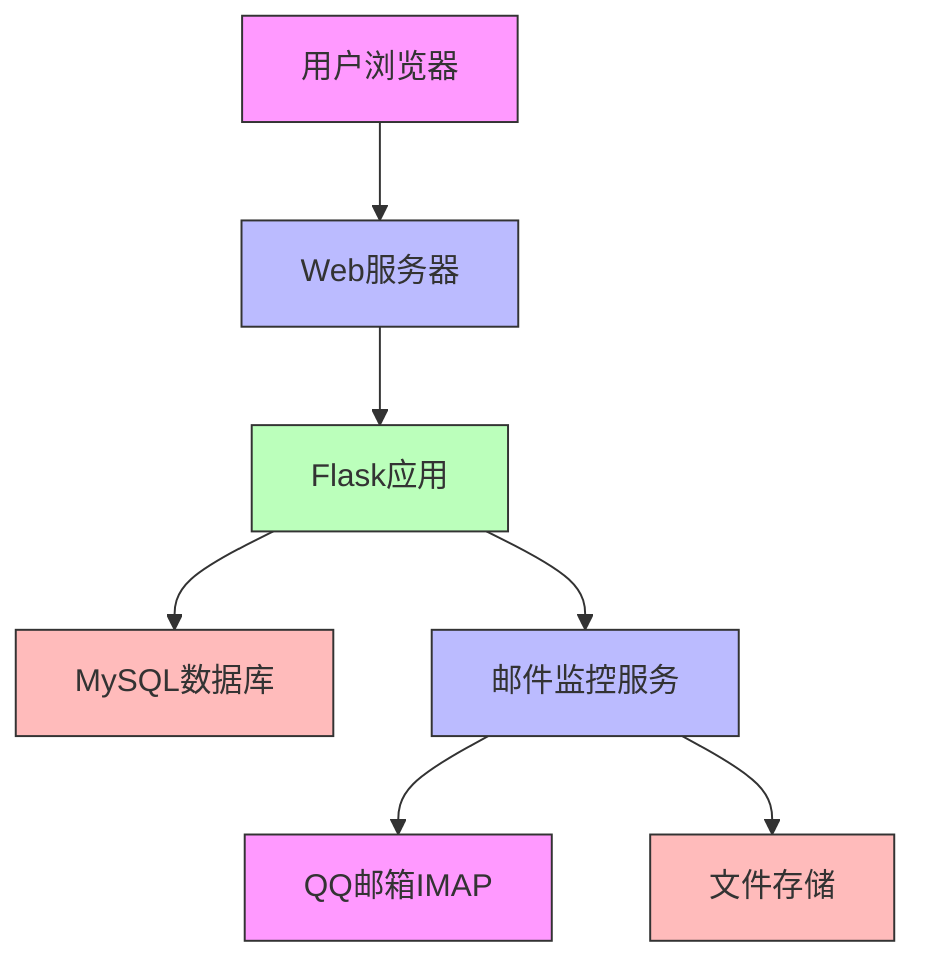
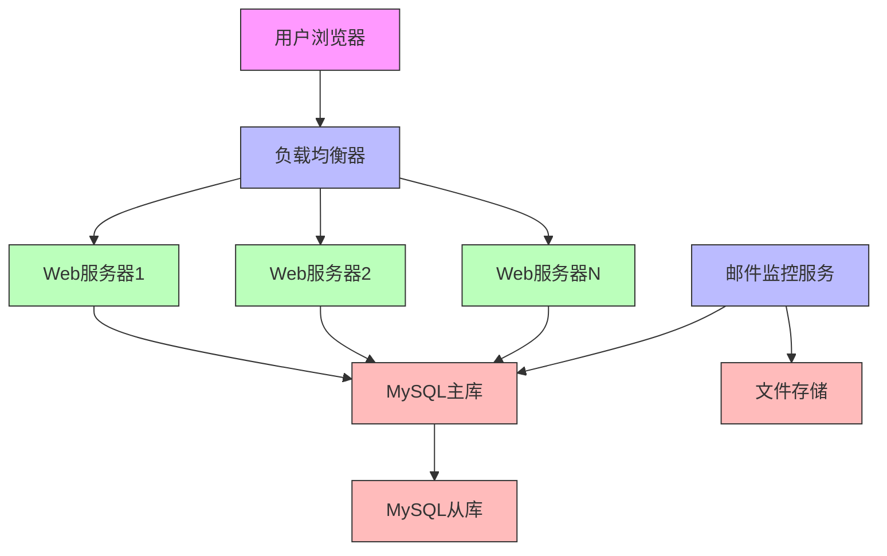
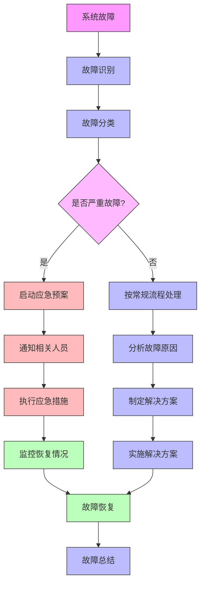

# 邮箱监控系统部署和运维文档

## 1. 概述

本部署和运维文档详细描述了邮箱监控系统的部署流程、环境要求、运维管理等方面，确保系统能够稳定运行。

## 2. 系统环境要求

### 2.1 硬件要求
- **CPU**: 2核或以上
- **内存**: 4GB或以上
- **存储**: 50GB可用磁盘空间（根据邮件量调整）
- **网络**: 稳定的互联网连接

### 2.2 软件环境
- **操作系统**: Windows/Linux/macOS
- **Python版本**: 3.7或以上
- **数据库**: MySQL 5.7或以上
- **Web服务器**: 支持WSGI的Web服务器（如Apache、Nginx）

## 3. 部署流程

### 3.1 环境准备
1. 安装Python 3.7+
2. 安装MySQL数据库
3. 确保系统可以访问互联网

### 3.2 代码获取
```bash
# 克隆项目代码
git clone <项目地址>
cd cloudfare-qq-mail
```

### 3.3 依赖安装
```bash
# 安装Python依赖
pip install -r requirements.txt
```

### 3.4 数据库配置
1. 修改`email_config.py`文件中的数据库连接信息
2. 确保MySQL服务正在运行
3. 创建数据库和表格：
```bash
cd cloudfare-qq-mail
python database/setup_database.py
```

### 3.5 邮箱配置
在`email_config.py`中配置以下信息：
- QQ邮箱账号
- QQ邮箱授权码
- 目标域名
- 其他相关配置

### 3.6 应用启动
```bash
# 启动Flask应用
python app.py

# 启动邮件监控服务
python realtime_monitor.py
```

### 3.7 访问应用
在浏览器中打开 `http://localhost:5000`

## 4. 部署架构

### 4.1 单机部署架构


### 4.2 分布式部署架构


## 5. 配置文件说明

### 5.1 email_config.py
```python
# QQ邮箱配置
QQ_EMAIL = "your_email@qq.com"
QQ_AUTH_CODE = "your_auth_code"

# IMAP服务器配置
IMAP_SERVER = "imap.qq.com"
IMAP_PORT = 993
USE_SSL = True

# 邮件处理配置
EMAIL_SAVE_DIR = "./received_emails"
CHECK_INTERVAL = 6

# 邮件过滤配置
TARGET_DOMAIN = "shiep.edu.kg"
PROCESS_HISTORICAL = False

# 数据库配置
DB_HOST = "localhost"
DB_USER = "root"
DB_PASSWORD = "your_password"
DB_NAME = "cloudfare_qq_mail"
```

### 5.2 数据库配置
在`database/setup_database.py`中配置数据库连接信息

## 6. 运维管理

### 6.1 系统监控
- **应用状态监控**: 监控Flask应用和邮件监控服务的运行状态
- **数据库监控**: 监控数据库连接和性能
- **磁盘空间监控**: 监控邮件存储和系统磁盘使用情况
- **网络监控**: 监控与QQ邮箱服务器的连接状态

### 6.2 日志管理
- **应用日志**: 记录Flask应用的运行日志
- **监控日志**: 记录邮件监控服务的运行日志
- **错误日志**: 记录系统错误和异常信息
- **访问日志**: 记录用户访问和操作日志

### 6.3 备份策略
- **数据库备份**: 定期备份用户数据和邮件元数据
- **邮件备份**: 定期备份重要的.eml文件
- **配置备份**: 备份系统配置文件

### 6.4 性能优化
- **数据库优化**: 定期优化数据库表和索引
- **文件清理**: 定期清理过期的邮件文件
- **缓存优化**: 使用缓存提高系统响应速度

## 7. 故障处理

### 7.1 常见故障及解决方案

#### 7.1.1 数据库连接失败
**现象**: 系统无法连接到数据库
**解决方案**:
1. 检查数据库服务是否启动
2. 检查数据库连接配置是否正确
3. 检查防火墙设置是否阻止了数据库连接

#### 7.1.2 邮箱连接失败
**现象**: 邮件监控服务无法连接到QQ邮箱
**解决方案**:
1. 检查QQ邮箱账号和授权码是否正确
2. 检查网络连接是否正常
3. 检查QQ邮箱IMAP设置是否开启

#### 7.1.3 应用启动失败
**现象**: Flask应用无法启动
**解决方案**:
1. 检查Python环境和依赖是否安装正确
2. 检查端口是否被占用
3. 查看错误日志定位问题

### 7.2 应急响应流程


## 8. 升级维护

### 8.1 版本升级流程
1. 备份当前系统和数据
2. 下载新版本代码
3. 对比配置文件差异
4. 升级数据库结构（如有需要）
5. 重启服务
6. 验证系统功能

### 8.2 数据库升级
```sql
-- 数据库升级脚本示例
-- 添加新字段
ALTER TABLE users ADD COLUMN last_login TIMESTAMP DEFAULT CURRENT_TIMESTAMP;

-- 修改字段类型
ALTER TABLE emails MODIFY COLUMN content LONGTEXT;

-- 添加索引
CREATE INDEX idx_sender_email ON emails(sender_email);
```

### 8.3 配置更新
- 更新配置文件
- 重启相关服务
- 验证配置生效

## 9. 安全管理

### 9.1 安全配置
- 定期更新系统和软件补丁
- 配置防火墙规则
- 使用安全的密码策略
- 启用SSL/TLS加密传输

### 9.2 安全监控
- 监控异常登录行为
- 监控数据库访问异常
- 监控文件访问异常
- 定期进行安全扫描

### 9.3 数据保护
- 敏感数据加密存储
- 定期备份重要数据
- 访问控制和权限管理
- 数据传输加密

## 10. 性能调优

### 10.1 数据库调优
- 优化查询语句
- 添加合适的索引
- 定期分析表结构
- 调整数据库参数

### 10.2 应用调优
- 优化代码逻辑
- 使用缓存机制
- 异步处理耗时操作
- 负载均衡部署

### 10.3 系统调优
- 调整系统参数
- 优化文件系统
- 合理分配资源
- 监控系统性能

## 11. 监控指标

### 11.1 应用监控指标
- 应用响应时间
- 请求处理成功率
- 并发用户数
- 内存和CPU使用率

### 11.2 数据库监控指标
- 数据库连接数
- 查询响应时间
- 慢查询数量
- 磁盘IO使用率

### 11.3 邮件监控指标
- 邮件处理成功率
- 邮件处理延迟
- 邮件队列长度
- IMAP连接状态

## 12. 自动化运维

### 12.1 自动化脚本
```bash
#!/bin/bash
# 系统健康检查脚本
echo "检查应用状态..."
# 检查Flask应用
curl -s http://localhost:5000 > /dev/null
if [ $? -eq 0 ]; then
    echo "应用运行正常"
else
    echo "应用运行异常"
fi

# 检查数据库连接
echo "检查数据库连接..."
mysql -h localhost -u root -p$DB_PASSWORD -e "SELECT 1" > /dev/null 2>&1
if [ $? -eq 0 ]; then
    echo "数据库连接正常"
else
    echo "数据库连接异常"
fi
```

### 12.2 定时任务
```bash
# 定时清理过期邮件文件
0 2 * * * find /path/to/received_emails -name "*.eml" -mtime +7 -delete

# 定时备份数据库
0 3 * * 0 mysqldump -h localhost -u root -p$DB_PASSWORD cloudfare_qq_mail > /backup/cloudfare_qq_mail_$(date +%Y%m%d).sql
```

## 13. 灾难恢复

### 13.1 灾难恢复计划
- 制定详细的灾难恢复流程
- 定期演练灾难恢复过程
- 准备备用系统和数据
- 建立应急响应团队

### 13.2 数据恢复流程
1. 确认数据丢失范围
2. 从备份中恢复数据
3. 验证数据完整性
4. 恢复系统服务

## 14. 文档维护

### 14.1 文档更新
- 随系统升级更新文档
- 记录重要的配置变更
- 更新故障处理流程
- 完善最佳实践

### 14.2 知识管理
- 建立知识库
- 记录常见问题和解决方案
- 分享运维经验和技巧
- 定期培训运维人员